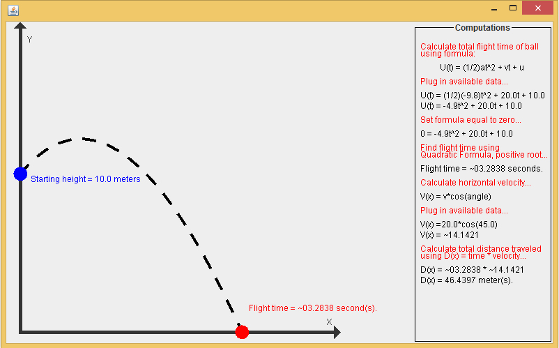

Name: Joseph Morris
Project #1, Projectile Motion
Date: 10-16-10

# Note:
This code has not been edited or maintained since it was written. It serves as an early example of my explorations in coding.

# Description:
Each component of this program serves a different purpose, FOR INSTRUCTIONS ON USE OF EACH SEE LIST OF FILES BELOW:

PositionCalculator.java - This class uses the following formula in order to calculate the position of a ball at time t:U(t)= (1/2)at^2+vt+u. This formula is the same as the formula for the motion of any particle in one dimension. Motion, in this particular case, is defined in terms of an amount of acceleration (a), a starting velocity (v), a starting position (u), and an amount of time elapsed (t).

RootFinder.java - This class uses the following formula in order to calculate the roots of a quadratic equation: x = ((-b + sqrt(b^2-4*a*c))/(2*a)), x = ((-b - sqrt(b^2-4*a*c))/(2*a)). Where: a, b, and c are the coefficients of the quadratic equation. This pertains to the problem in that it can later be used to calculate the total flight time of the ball. This program will terminate if there are no real roots. 

SimpleFlightTimeFinder.java - This class uses the methods of the RootFinder class in order to find the total flight time of the ball. To do this, the program finds the roots of the formula: U(t)= (1/2)at^2+vt+u. Where: a = -9.8 (constant of gravity). This class includes a modified RootFinder method that only returns the positive root of the solution set. This is due to the fact that you cannot have a negative flight time. This program will terminate if there are no real roots. 

FlightTimeFinder.java - This class uses the methods of the SimpleFlightTimeFinder class in order to find the total flight time needed to reach a certain position above the ground. This class includes a modified RootFinder method that only returns the positive root of the solution set. This is due to the fact that you cannot have a negative flight time. This program will terminate if there are no real roots.

DistanceCalculator.java - This class calculates the total lateral distance traveled by the ball. In order to find this the program first calculates the total flight time of the ball using the methods of the SimpleFlightTimeFinder class. The program then calculates the horizontal velocity of the ball using the formula: V(x) = v*cos(x), where x is the angle at which the ball is thrown, and v is the initial velocity of the ball. To calculate to total lateral distance, the program simply multiplies the horizontal velocity and the flight time. This program will terminate if there are no real roots.

TrajectoryPlotter.java - This class includes the methods and calculations used in the DistanceCalculator class. After prompting the user for information, the program draws a graph of the trajectory of the ball; giving both the starting height, and the flight time on the graph. A side computations panel gives a detailed, step-by-step analysis of how the total lateral distance is calculated. This program will terminate if there are no real roots.

# Included Files and Instructions for Usage of Files:
* README.txt
* PositionCalculator.java
* RootFinder.java
* SimpleFlightTimeFinder.java
* FlightTimeFinder.java
* DistanceCalculator.java
* TrajectoryPlotter.java

README.txt:
This file.

PositionCalculator.java:
The input method for this program is the JOptionPane input dialog. The program guides the user's input. The program asks for the following information: An accelration rate, a starting velocity, a starting position, and an amount of time that passes. The user-defined test cases are as follows for this program:

a = -9.8 v = 40 u = 44.1 t = 6.2 return = 103.744
a = 5	 v = 5	u = 5	 t = 5	 return = 92.5
a = -9.8 v = 0	u = 15	 t = 1	 return = 10.1
a = 5	 v = 10	u = 5	 t = 10	 return = 355

RootFinder.java:
The input method for this program is the JOptionPane input dialog. The program guides the user's input. The program asks for the following information: coefficient of A, coefficient of B, coefficient of C. The user-defined test cases are as follows for this program:

x^2+2x+1 = (-1.0, -1.0)

x^2-7x+0 = (7.0, 0.0)

2x^2+7x+3 = (-0.5,-3.0)

SimpleFlightTimeFinder.java:
The input method for this program is the JOptionPane input dialog. The program guides the user's input. The program asks for the following information: an initial height, and an initial velocity. The user-defined test cases are as follows for this program:

Initial height: 3, Initial velocity: 15, Flight Time: ~3.24962 seconds.
Initial height: 10, Initial velocity: 10, Flight Time: ~2.77598 seconds.
Initial height: 4, Initial velocity: 8, Flight Time: ~2.03399 seconds.

FlightTimeFinder.java:
The input method for this program is the JOptionPane input dialog. The program guides the user's input. The program asks for the following information: an initial height, an initial velocity, and a target height. The user-defined test cases are as follows for this program:

Initial height: 3, Initial velocity: 15, Target height: 4, Flight Time: ~0.06818 seconds.
Initial height: 10, Initial velocity: 10, Target height: 12, Flight Time: ~0.22475 seconds.
Initial height: 4, Initial velocity: 8, Target height: 6, Flight Time: ~0.30816 seconds.

DistanceCalculator.java:
The input method for this program is the JOptionPane input dialog. The program guides the user's input. The program asks for the following information: an initial velocity, the angle at which the ball is thrown, and a starting height. The user-defined test cases are as follows for this program:

Initial velocity: 10, Angle: 10 degrees, Starting height: 10, Total Distance: ~27.33811 meters.
Initial velocity: 10, Angle: 20 degrees, Starting height: 30, Total Distance: ~60.51034 meters.
Initial velocity: 20, Angle: 40 degrees, Starting height: 60, Total Distance: ~192.57775 meters.

TrajectoryPlotter.java:
The input method for this program is the JOptionPane input dialog. The program guides the user's input. The program asks for the following information: an initial velocity, the angle at which the ball is thrown, and a starting height. The user-defined test cases are as follows for this program:

Initial velocity: 10, Angle: 10 degrees, Starting height: 10, Total Distance: ~27.33811 meters.
Initial velocity: 10, Angle: 20 degrees, Starting height: 30, Total Distance: ~60.51034 meters.
Initial velocity: 20, Angle: 40 degrees, Starting height: 60, Total Distance: ~192.57775 meters.

# Parts Implemented:
All

# Parts Not Implemented:
N/A

# Notes:
This program utilizes various slightly more advanced concept such as declaring classes within another class. It also uses many graphics concepts and packages, including: Graphics2D, Borders, BorderLayouts, QuadCurve2D, Panels within Panels, etc. Also, it uses the System.exit() statement in order to terminate the program in the event that a calculation error occurs, or in the event that the user enters data that is out of range.

# Known Bugs:
There are no known bugs so long as the users enters the correct type of data (integers/doubles as opposed to strings) when prompted for input.

# Extra Credit:
See Notes.

# Sample Output:

See User-defined test cases listed above for sample output of each program.
